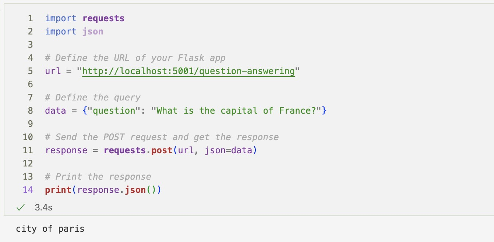

# Question Answering API with RAG

This repository contains a Flask API that uses the RAG model from Hugging Face's transformers for question answering.

## Getting Started

These instructions will guide you on how to deploy and use the Question Answering API.

### Prerequisites

This application requires Python 3.6+.

### Setup

* Clone this repository
* In your terminal, navigate to the repository path
* Install the necessary dependencies:

```bash
pip install -r requirements.txt
```

## Deployment

To start the server, run the `app.py` script:

```bash
python3 app.py
```

This will start a Flask server at http://localhost:5001/

## Usage

To use the API, send a POST request to the `/question-answering` endpoint with your question included as JSON data. 

Here's an example using `curl`:

```bash
curl -X POST http://localhost:5001/question-answering -H "Content-Type: application/json" -d '{"question":"What is the capital of France?"}'
```

Replace `"What is the capital of France?"` with your own question. The server will respond with an answer to your question.

Below is a sample of the JSON response from a Jupyter nootebook:



